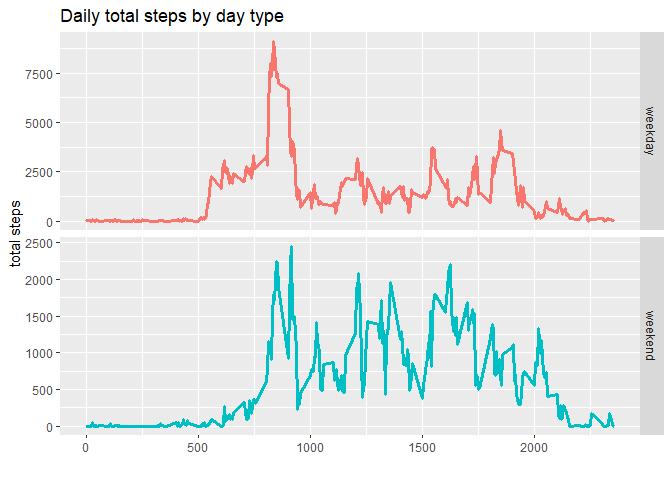

## Introduction

It is now possible to collect a large amount of data about personal
movement using activity monitoring devices such as a
[Fitbit](http://www.fitbit.com), [Nike
Fuelband](http://www.nike.com/us/en_us/c/nikeplus-fuelband), or
[Jawbone Up](https://jawbone.com/up). These type of devices are part of
the "quantified self" movement -- a group of enthusiasts who take
measurements about themselves regularly to improve their health, to
find patterns in their behavior, or because they are tech geeks. But
these data remain under-utilized both because the raw data are hard to
obtain and there is a lack of statistical methods and software for
processing and interpreting the data.

This assignment makes use of data from a personal activity monitoring
device. This device collects data at 5 minute intervals through out the
day. The data consists of two months of data from an anonymous
individual collected during the months of October and November, 2012
and include the number of steps taken in 5 minute intervals each day.

## Data

The data for this assignment can be downloaded from the course web
site:

* Dataset: [Activity monitoring data](https://d396qusza40orc.cloudfront.net/repdata%2Fdata%2Factivity.zip) [52K]

The variables included in this dataset are:

* **steps**: Number of steps taking in a 5-minute interval (missing
    values are coded as `NA`)

* **date**: The date on which the measurement was taken in YYYY-MM-DD
    format

* **interval**: Identifier for the 5-minute interval in which
    measurement was taken


The dataset is stored in a comma-separated-value (CSV) file and there
are a total of 17,568 observations in this
dataset.


## Assignment

This assignment will be described in multiple parts. You will need to
write a report that answers the questions detailed below. Ultimately,
you will need to complete the entire assignment in a **single R
markdown** document that can be processed by **knitr** and be
transformed into an HTML file.

Throughout your report make sure you always include the code that you
used to generate the output you present. When writing code chunks in
the R markdown document, always use `echo = TRUE` so that someone else
will be able to read the code. **This assignment will be evaluated via
peer assessment so it is essential that your peer evaluators be able
to review the code for your analysis**.

For the plotting aspects of this assignment, feel free to use any
plotting system in R (i.e., base, lattice, ggplot2)

Fork/clone the [GitHub repository created for this
assignment](http://github.com/rdpeng/RepData_PeerAssessment1). You
will submit this assignment by pushing your completed files into your
forked repository on GitHub. The assignment submission will consist of
the URL to your GitHub repository and the SHA-1 commit ID for your
repository state.

NOTE: The GitHub repository also contains the dataset for the
assignment so you do not have to download the data separately.


## Loading and preprocessing the data


Load the necessary libraries

```r
library(tidyverse)
library(janitor)
library(lubridate)
library(knitr)
```

Unzip and load the data

```r
#unzip the data
unzip('activity.zip')

#load the data
data = read_csv('activity.csv') %>%
      clean_names()
```
Check the data


```r
str(data)
```

```
## tibble [17,568 x 3] (S3: spec_tbl_df/tbl_df/tbl/data.frame)
##  $ steps   : num [1:17568] NA NA NA NA NA NA NA NA NA NA ...
##  $ date    : Date[1:17568], format: "2012-10-01" "2012-10-01" ...
##  $ interval: num [1:17568] 0 5 10 15 20 25 30 35 40 45 ...
##  - attr(*, "spec")=
##   .. cols(
##   ..   steps = col_double(),
##   ..   date = col_date(format = ""),
##   ..   interval = col_double()
##   .. )
```


## What is mean total number of steps taken per day?

Calculate the total steps daily

```r
total_steps_daily = data %>%
      group_by(date) %>%
      summarise(total_steps = sum(steps, na.rm = FALSE))
```
Make a histogram of total number of steps taken each day


```r
plot_steps = total_steps_daily %>%
      ggplot(aes(total_steps))+
      geom_histogram(fill = 'steelblue')+
      labs(title = 'Histogram of step count',
           y = 'Frequency of count',
           x = '')+
      theme_minimal()

ggsave('plot_steps.png',plot_steps)
plot_steps
```

<!-- -->

Calculate and report the median and total number of steps taken per day

```r
steps_summary = total_steps_daily%>%
      summarise(mean_steps = mean(total_steps, na.rm = TRUE),
             median_steps = median(total_steps, na.rm = TRUE)) %>%
      as.list() %>%
      unlist

steps_summary
```

```
##   mean_steps median_steps 
##     10766.19     10765.00
```


## What is the average daily activity pattern?

1. Make a time series plot (i.e. type = "l") of the 5-minute interval (x-axis) and the average number of steps taken, averaged across all days (y-axis)

Calculate the total steps per interval

```r
steps_by_interval = data %>%
      group_by(interval) %>%
      summarise(total_steps = sum(steps, na.rm = TRUE))
```
Plot the number of steps per interval

```r
plot_steps_interval = steps_by_interval %>%
      ggplot(aes(interval, total_steps))+
      geom_line(color = 'steelblue', size = 1.5)+
      labs(title = 'Number of total steps by interval',
           y = 'total steps',
           x = 'interval (mins)')+
      theme_minimal()

ggsave('plot_steps_interval.png',plot_steps_interval)
```

```
## Saving 7 x 5 in image
```

```r
plot_steps_interval
```

<!-- -->
Identify which 5-minute interval, on average across all the days in the dataset, contains the maximum number of steps?


```r
interval_max_count = steps_by_interval %>%
      filter(total_steps == max(total_steps)) %>%
      as.list() %>%
      unlist()

interval_max_count
```

```
##    interval total_steps 
##         835       10927
```

## Imputing missing values

Calculate and report the total number of missing values in the dataset (i.e. the total number of rows with NAs)


```r
map_dbl(data, function(x) sum(is.na(x)))
```

```
##    steps     date interval 
##     2304        0        0
```

Devise a strategy for filling in all of the missing values in the dataset. The strategy does not need to be sophisticated. For example, you could use the mean/median for that day, or the mean for that 5-minute interval, etc.

Fill NA values using mean of group

```r
filled_data = data %>%
      mutate(steps = as.numeric(steps)) %>%
      group_by(date) %>%
      mutate(steps = ifelse(is.na(steps), mean(steps, na.rm = TRUE), steps)) %>%
      mutate(steps = coalesce(steps, 0))
```

Create a new dataset that is equal to the original dataset but with the missing data filled in.

```r
filled_data %>%
      write_csv('complete_activity.csv')
```

Compute for the total number of steps per day using the complete data

```r
total_steps_daily_complete =  filled_data %>%
      group_by(date) %>%
      summarise(total_steps = sum(steps, na.rm = TRUE))
```

Make a histogram of total number of steps taken each day


```r
plot_steps_complete = total_steps_daily_complete %>%
      ggplot(aes(total_steps))+
      geom_histogram(fill = 'steelblue')+
      labs(title = 'Histogram of step count',
           y = 'Frequency of count',
           x = '')+
      theme_minimal()

ggsave('plot_steps_complete.png',plot_steps_complete)
plot_steps_complete
```

<!-- -->
We can see that there are more zeros now.


```r
steps_summary_complete = total_steps_daily_complete %>%
      summarise(mean_steps = mean(total_steps),
             median_steps = median(total_steps)) %>%
      as.list() %>%
      unlist

steps_summary_complete
```

```
##   mean_steps median_steps 
##      9354.23     10395.00
```
What is the impact of imputing missing data on the estimates of the total daily number of steps?


```r
rbind(steps_summary_complete, steps_summary)
```

```
##                        mean_steps median_steps
## steps_summary_complete    9354.23        10395
## steps_summary            10766.19        10765
```

Imputing the data reduced the total mean steps while having similar median steps.

## Are there differences in activity patterns between weekdays and weekends?


Create a new factor variable in the dataset with two levels -- "weekday" and "weekend" indicating whether a given date is a weekday or weekend day.


Using lubridate, find the day and identify if weekend or weekday

```r
by_week_data = filled_data %>%
      mutate(day = wday(date, label = TRUE)) %>%
      mutate(day_type = factor(ifelse(day == 'Sun' | day == 'Sat', 'weekend', 'weekday')))
```


Make a panel plot containing a time series plot (i.e. type = "l") of the 5-minute interval (x-axis) and the average number of steps taken, averaged across all weekday days or weekend days (y-axis). The plot should look something like the following, which was created using simulated data:

Plot the graph

```r
weekday_weekend_plot = by_week_data %>%
      group_by(interval, day_type) %>%
      summarise(total_steps = sum(steps, na.rm = TRUE)) %>%
      ggplot(aes(interval, total_steps))+
      geom_line(aes(color = day_type), size = 1.2)+
      facet_grid(day_type ~ ., scales = 'free')+
      labs(title = 'Daily total steps by day type',
           x = '',
           y = 'total steps',
           color = 'day type')+
            theme(legend.position = 'none')

ggsave('weekday_weekend_plot.png',weekday_weekend_plot)

weekday_weekend_plot
```

<!-- -->


## Submitting the Assignment

To submit the assignment:

1. Commit your completed `PA1_template.Rmd` file to the `master` branch of your git repository (you should already be on the `master` branch unless you created new ones)

2. Commit your `PA1_template.md` and `PA1_template.html` files produced by processing your R markdown file with the `knit2html()` function in R (from the **knitr** package)

3. If your document has figures included (it should) then they should have been placed in the `figure/` directory by default (unless you overrode the default). Add and commit the `figure/` directory to your git repository.

4. Push your `master` branch to GitHub.

5. Submit the URL to your GitHub repository for this assignment on the course web site.

In addition to submitting the URL for your GitHub repository, you will
need to submit the 40 character SHA-1 hash (as string of numbers from
0-9 and letters from a-f) that identifies the repository commit that
contains the version of the files you want to submit. You can do this
in GitHub by doing the following:

1. Go into your GitHub repository web page for this assignment

2. Click on the "?? commits" link where ?? is the number of commits you have in the repository. For example, if you made a total of 10 commits to this repository, the link should say "10 commits".

3. You will see a list of commits that you have made to this repository. The most recent commit is at the very top. If this represents the version of the files you want to submit, then just click the "copy to clipboard" button on the right hand side that should appear when you hover over the SHA-1 hash. Paste this SHA-1 hash into the course web site when you submit your assignment. If you don't want to use the most recent commit, then go down and find the commit you want and copy the SHA-1 hash.

A valid submission will look something like (this is just an **example**!)

```r
https://github.com/rdpeng/RepData_PeerAssessment1

7c376cc5447f11537f8740af8e07d6facc3d9645
```
